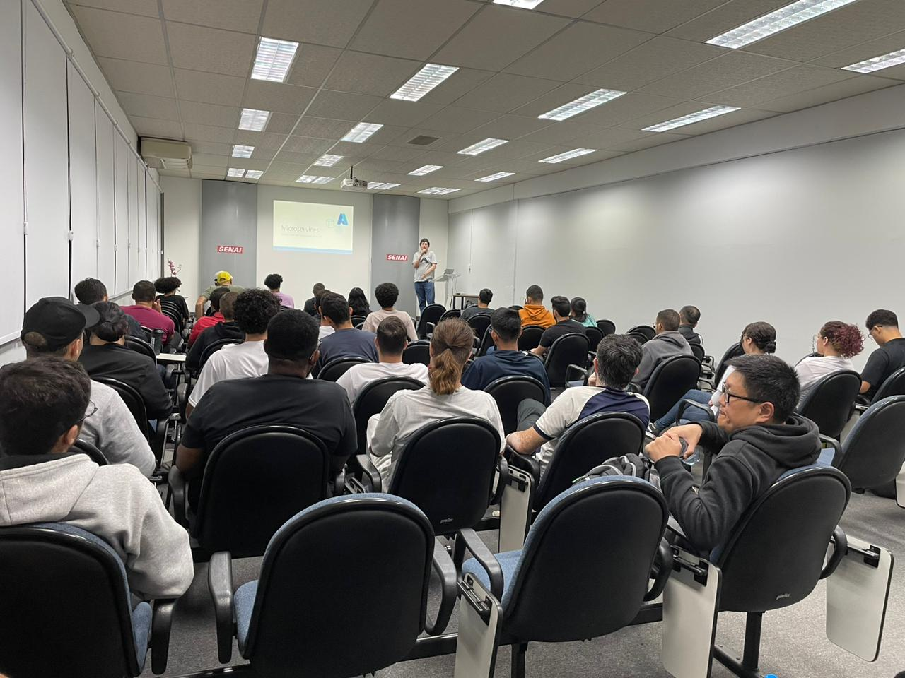
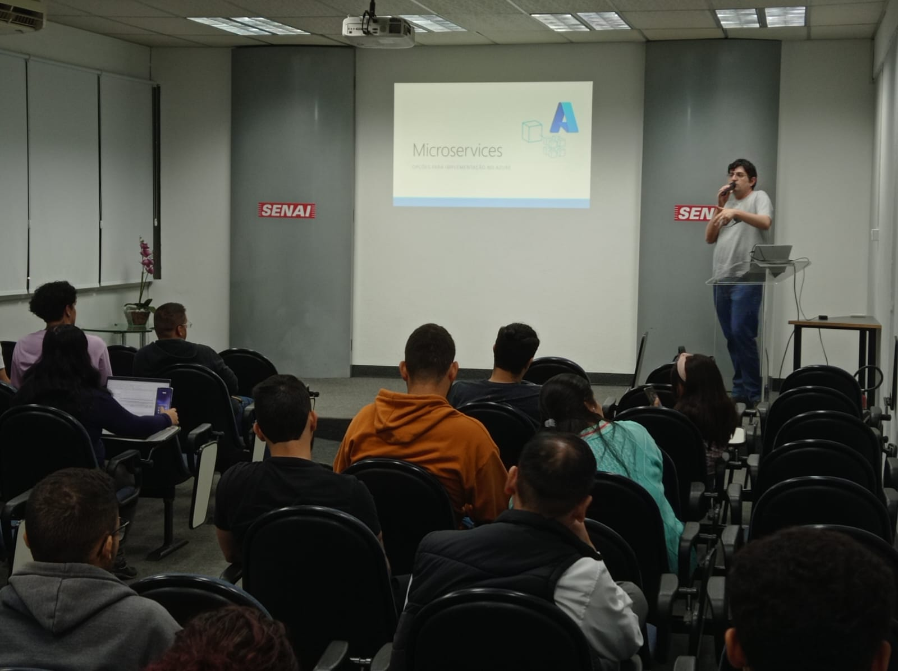
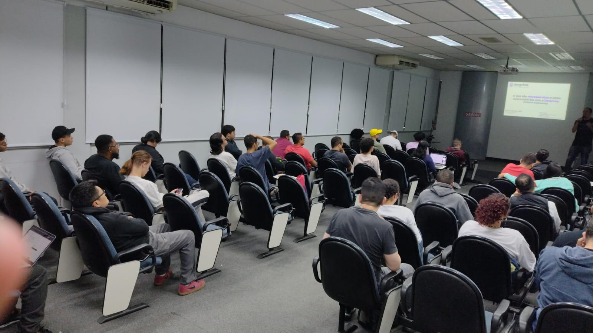
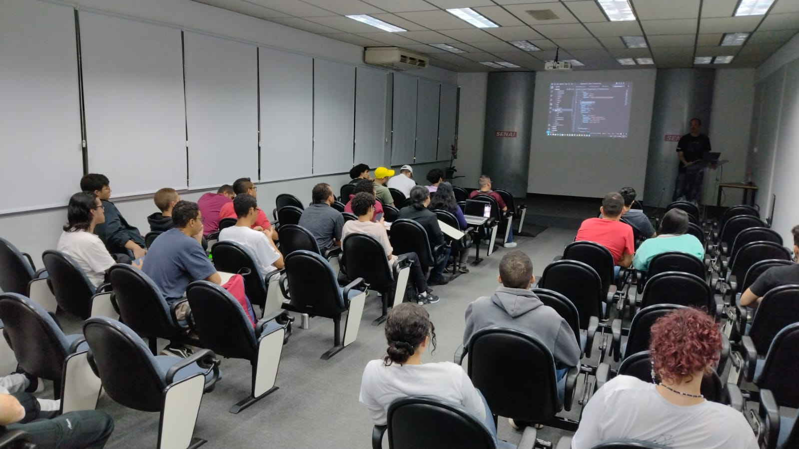

# Microservices-2023-08
Fotos e informações gerais sobre o evento "Microservices no Microsoft Azure: alternativas para a implementação", realizado em 12/08/2023 na cidade de São Paulo-SP.

Organizadores:
- **Renato Groffe (Microsoft MVP, MTAC)**
- **Atila Olivi (SENAI)**

Número de participantes: **40 pessoas**

Apresentações/talks que aconteceram durante o evento:
* **Arquiteturas baseadas em Microsserviços e opcões para implementação no Azure - Renato Groffe (Microsoft MVP, MTAC)**

* **Desenvolvendo o primeiro Microsserviço em 30 minutos usando C# e Devprime - Ramon Durães (Microsoft MVP Reconnect)**

Tecnologias abordadas: **Azure App Service, Azure Functions, Azure Container Apps, Azure Kubernetes Service, .NET 7, ASP.NET Core, Linux, Kafka, RabbitMQ**

Acesse este [**link**](/img/) para visualizar todas as fotos das apresentações.

Este evento foi uma parceria entre a comunidade [**.NET SP**](https://www.meetup.com/dotnet-Sao-Paulo/) e a [**Escola Senai Suíço-Brasileira Paulo Ernesto Tolle**](https://suicobrasileira.sp.senai.br/).

Formulário utilizado para inscrições: [**Sympla**](https://www.sympla.com.br/evento/microservices-no-microsoft-azure-alternativas-para-a-implementacao-gratuito-e-presencial/2001537)

Local: Escola SENAI Suíço-Brasileira Paulo Ernesto Tolle - Rua Bento Branco de Andrade Filho, 379 - Santo Amaro - São Paulo/SP - CEP 04757-000

